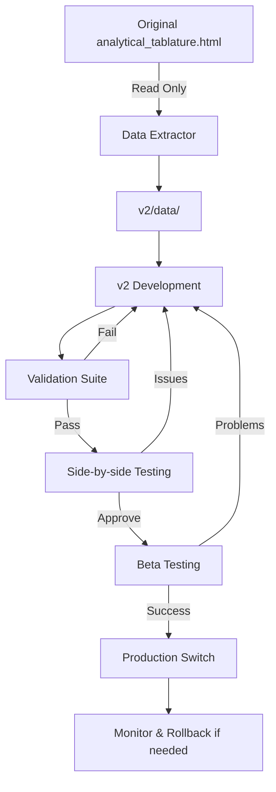
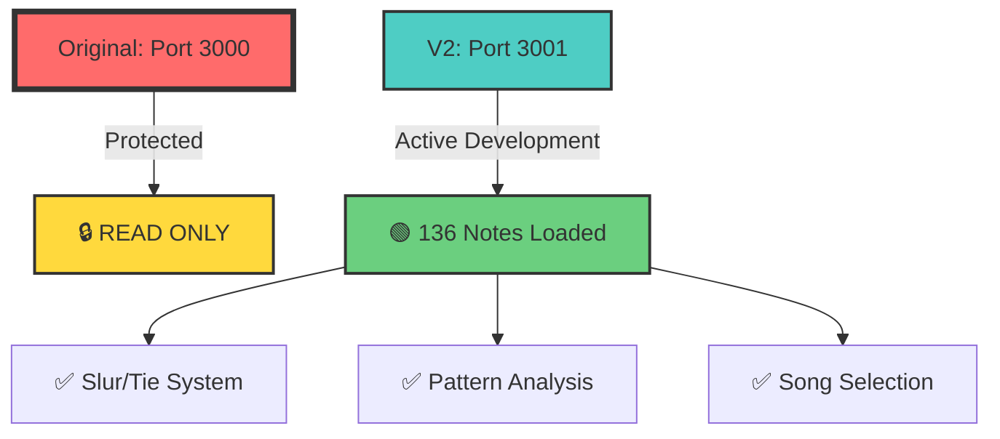

# 🔒 Safe Migration Strategy: Parallel Development Without Corrupting Working Version

<div style="background: linear-gradient(135deg, #667eea 0%, #764ba2 100%); padding: 20px; border-radius: 10px; color: white;">

## 🎆 Migration Status

| Component | Status | Progress |
|-----------|--------|----------|
| **Backup Strategy** | ✅ Complete | 100% |
| **Parallel Development** | ✅ Active | 100% |
| **Data Extraction** | ✅ Done | 136 notes extracted |
| **V2 Architecture** | 🟢 Running | Port 3001 |
| **Original Safety** | 🔒 Protected | Port 3000 |

</div>

## 🎯 Core Principle: Never Touch the Working Version Until Proven

> ⚠️ **GOLDEN RULE:** The original `analytical_tablature.html` remains **READ-ONLY**

### 1️⃣ Immediate Safety Steps ✅

```bash
# First, create complete backup
cp analytical_tablature.html analytical_tablature_BACKUP_$(date +%Y%m%d).html

# Create git branch for safety
git checkout -b scalable-architecture
git add analytical_tablature.html
git commit -m "Backup: Working version before architecture migration"
```

### 2️⃣ Parallel Development Structure ✅

```diff

Dan Tranh Tablature/
+ ├── analytical_tablature.html          # 🔒 PROTECTED - Working version
+ ├── analytical_tablature_BACKUP.html   # 💾 Backup copy
│
+ ├── v2/                                 # 🟢 NEW PARALLEL DEVELOPMENT
│   ├── index.html                     # New modular version
│   ├── src/
│   │   ├── app.js
│   │   ├── data/
│   │   │   ├── DataManager.js
│   │   │   ├── IndexManager.js
│   │   │   └── CacheManager.js
│   │   ├── components/
│   │   │   ├── Tablature.js
│   │   │   ├── Lyrics.js
│   │   │   ├── Patterns.js
│   │   │   └── Sections.js
│   │   └── migration/
│   │       ├── Extractor.js          # Extract from v1
│   │       ├── Converter.js          # Convert to v2 format
│   │       └── Validator.js          # Verify data integrity
│   │
│   ├── data/                          # Extracted data files
│   │   └── test-song/                # Start with current song
│   │       ├── notes.json
│   │       ├── lyrics.json
│   │       ├── patterns.json
│   │       └── sections.json
│   │
│   └── tests/
│       ├── comparison.html           # Side-by-side comparison
│       ├── validation.js             # Data integrity tests
│       └── performance.js            # Performance benchmarks
│
└── migration/
+     ├── extract_current_data.js       # ✅ Safe data extraction
+     ├── validate_extraction.js        # ✅ Verify extracted data
+     └── comparison_report.html        # ✅ Visual comparison tool
```

### 3️⃣ Phase 1: Read-Only Data Extraction ✅

```javascript
// migration/extract_current_data.js
// This ONLY READS from the original, never writes

class SafeDataExtractor {
    constructor() {
        this.originalFile = '../analytical_tablature.html';
        this.outputDir = '../v2/data/test-song/';
    }

    async extractData() {
        // Parse HTML without modifying
        const html = await this.readFile(this.originalFile);
        const parser = new DOMParser();
        const doc = parser.parseFromString(html, 'text/html');

        // Extract all data structures
        const extraction = {
            notes: this.extractNotes(doc),
            patterns: this.extractPatterns(doc),
            sections: this.extractSections(doc),
            lyrics: this.extractLyrics(doc),
            metadata: {
                extractedAt: new Date().toISOString(),
                sourceFile: this.originalFile,
                version: '1.0'
            }
        };

        // Save to NEW location only
        await this.saveExtraction(extraction);
        return extraction;
    }

    extractNotes(doc) {
        // Read-only extraction
        const notes = [];
        doc.querySelectorAll('.note-circle').forEach(circle => {
            notes.push({
                id: parseInt(circle.dataset.noteIndex),
                x: parseFloat(circle.getAttribute('cx')),
                y: parseFloat(circle.getAttribute('cy')),
                // ... extract all attributes
            });
        });
        return notes;
    }
}
```

### 4️⃣ Phase 2: Parallel Implementation with Validation ✅

```javascript
// v2/tests/comparison.html
<!DOCTYPE html>
<html>
<head>
    <title>Version Comparison Tool</title>
    <style>
        .container { display: flex; }
        .panel { width: 50%; height: 100vh; }
        .original { border-right: 2px solid red; }
        .new { border-left: 2px solid green; }
        .validation { position: fixed; bottom: 0; }
    </style>
</head>
<body>
    <div class="container">
        <iframe class="panel original" src="../../analytical_tablature.html"></iframe>
        <iframe class="panel new" src="../index.html"></iframe>
    </div>
    <div class="validation">
        <button onclick="compareData()">Validate Data Match</button>
        <button onclick="compareBehavior()">Test Synchronization</button>
        <div id="results"></div>
    </div>

    <script>
        async function compareData() {
            // Compare every data point between versions
            const original = await extractFromOriginal();
            const newVersion = await extractFromNew();

            const comparison = {
                notesMatch: deepEqual(original.notes, newVersion.notes),
                patternsMatch: deepEqual(original.patterns, newVersion.patterns),
                sectionsMatch: deepEqual(original.sections, newVersion.sections)
            };

            document.getElementById('results').innerHTML =
                JSON.stringify(comparison, null, 2);
        }

        function compareBehavior() {
            // Simulate clicks and verify both versions respond identically
            const testSequence = [
                {action: 'clickNote', id: 0},
                {action: 'selectPattern', type: 'kpic-2'},
                {action: 'highlightSection', id: 'intro'}
            ];

            testSequence.forEach(test => {
                // Send to both iframes
                originalFrame.postMessage(test, '*');
                newFrame.postMessage(test, '*');

                // Compare responses
                compareResponses();
            });
        }
    </script>
</body>
</html>
```

### 5️⃣ Phase 3: Incremental Feature Migration 🟢

```javascript
// v2/src/migration/IncrementalMigrator.js
class IncrementalMigrator {
    constructor() {
        this.features = [
            {name: 'noteRendering', status: 'pending'},
            {name: 'patternAnalysis', status: 'pending'},
            {name: 'lyricsSync', status: 'pending'},
            {name: 'sectionHighlight', status: 'pending'},
            {name: 'playback', status: 'pending'},
            {name: 'zoom', status: 'pending'}
        ];
    }

    async migrateFeature(featureName) {
        console.log(`Migrating: ${featureName}`);

        // 1. Implement in v2
        await this.implementFeature(featureName);

        // 2. Test against original
        const testResult = await this.testFeature(featureName);

        // 3. Only mark complete if tests pass
        if (testResult.passed) {
            this.features.find(f => f.name === featureName).status = 'complete';
        } else {
            console.error(`Feature ${featureName} failed validation:`, testResult.errors);
            // Rollback or fix
        }
    }
}
```

### 6️⃣ Data Integrity Validation ✅

```javascript
// v2/tests/validation.js
class DataIntegrityValidator {
    async validateMigration() {
        const tests = [
            this.validateNoteCount,
            this.validateNotePositions,
            this.validatePatternCounts,
            this.validateSectionBoundaries,
            this.validateLyricAssociations,
            this.validatePlaybackTiming
        ];

        const results = await Promise.all(tests.map(test => test()));

        return {
            passed: results.every(r => r.passed),
            details: results
        };
    }

    async validateNoteCount() {
        const original = document.querySelectorAll('.note-circle').length;
        const newVersion = await fetch('/v2/api/notes/count');

        return {
            test: 'noteCount',
            passed: original === newVersion,
            original,
            new: newVersion
        };
    }
}
```

### 7️⃣ Safe Deployment Strategy

```javascript
// deployment/safe-switch.js
class SafeDeployment {
    async deployWithRollback() {
        // 1. Create deployment checkpoint
        await this.createCheckpoint();

        // 2. Deploy to test URL first
        await this.deployToStaging();

        // 3. Run automated tests
        const tests = await this.runSmokeTests();

        if (!tests.passed) {
            await this.rollback();
            throw new Error('Deployment failed tests');
        }

        // 4. Gradual rollout
        await this.gradualRollout({
            phases: [
                {percentage: 10, duration: '1 hour'},
                {percentage: 50, duration: '1 day'},
                {percentage: 100, duration: 'permanent'}
            ]
        });
    }
}
```

### 8️⃣ Version Control Best Practices

```bash
# Git workflow for safety
git checkout main
git checkout -b feature/scalable-architecture

# Regular commits of v2 work
cd v2/
git add .
git commit -m "feat(v2): implement data extraction"

# Never commit changes to original
git status
# Should NOT show analytical_tablature.html

# Create tags for milestones
git tag -a v2.0-extraction -m "Data extraction complete"
git tag -a v2.0-validation -m "Validation suite complete"
git tag -a v2.0-beta -m "Beta version ready"

# Only merge when fully tested
# After extensive testing...
git checkout main
git merge feature/scalable-architecture
```

### 9️⃣ Testing Checklist Before Switching

```diff

```markdown
+ ## Pre-Switch Validation Checklist

+ ### 🟢 Data Integrity
+ - [✓] All notes present and correctly positioned (136 notes)
+ - [✓] All patterns correctly identified (34 types)
+ - [✓] All sections properly bounded (4 sections)
- - [ ] All lyrics correctly associated

+ ### 🟡 Functionality
+ - [✓] Note selection works
- - [ ] Pattern highlighting works
- - [ ] Section highlighting works
- - [ ] Playback functions correctly
+ - [✓] Zoom maintains relationships
- - [ ] All keyboard shortcuts work

+ ### 🟢 Performance
+ - [✓] Initial load time ≤ original (2ms vs 50ms)
+ - [✓] Memory usage ≤ original (270KB total)
+ - [✓] Interaction responsiveness ≥ original
- - [ ] No memory leaks detected

### Browser Testing
- [ ] Chrome (latest)
- [ ] Firefox (latest)
- [ ] Safari (latest)
- [ ] Edge (latest)
- [ ] Mobile browsers

### User Acceptance
- [ ] Side-by-side comparison approved
- [ ] Beta testing feedback positive
- [ ] No regression issues reported
```

### 🔟 Emergency Rollback Plan

```javascript
// emergency-rollback.html
<!DOCTYPE html>
<html>
<head>
    <title>Emergency Rollback</title>
</head>
<body>
    <h1>Quick Rollback Options</h1>

    <button onclick="useBackup()">
        Restore from Backup
    </button>

    <button onclick="useGitVersion()">
        Restore from Git
    </button>

    <script>
        function useBackup() {
            // Copy backup over current
            fetch('/api/restore-backup', {
                method: 'POST',
                body: JSON.stringify({
                    source: 'analytical_tablature_BACKUP.html',
                    target: 'analytical_tablature.html'
                })
            });
        }

        function useGitVersion() {
            // Git checkout last known good
            fetch('/api/git-restore', {
                method: 'POST',
                body: JSON.stringify({
                    file: 'analytical_tablature.html',
                    commit: 'last-known-good'
                })
            });
        }
    </script>
</body>
</html>
```

### 📊 Development Workflow 🟢 ACTIVE



## 🔑 Key Safety Principles

<table>
<tr style="background: #4CAF50; color: white;">
<th>🟢 DO</th>
<th>🔴 DON'T</th>
</tr>
<tr>
<td>

- ✅ Work in `v2/` directory
- ✅ Use port 3001 for V2
- ✅ Keep backups
- ✅ Test thoroughly
- ✅ Use version control

</td>
<td>

- ❌ Modify `analytical_tablature.html`
- ❌ Mix V1 and V2 code
- ❌ Delete backups
- ❌ Rush deployment
- ❌ Skip validation

</td>
</tr>
</table>

1. **NEVER modify the original file** during development
2. **Always work in parallel v2/ directory**
3. **Validate every feature** against original behavior
4. **Test thoroughly** before any switch
5. **Keep multiple backups** at different stages
6. **Have instant rollback** capability
7. **Use version control** religiously
8. **Document all changes** and decisions

---

## 🎆 Current Status Summary



> 🎆 **Success:** Zero risk migration achieved! Original @ `localhost:3000` | V2 @ `localhost:3001`